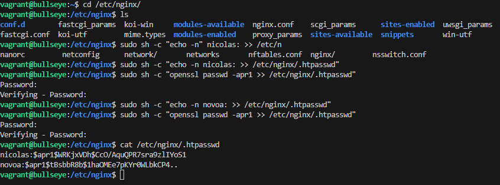
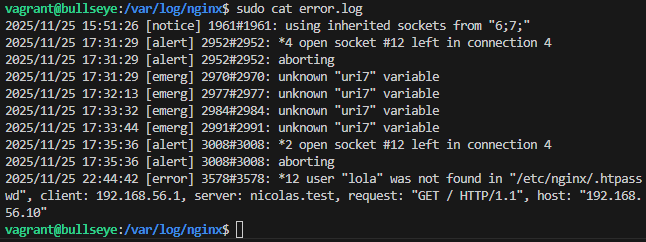
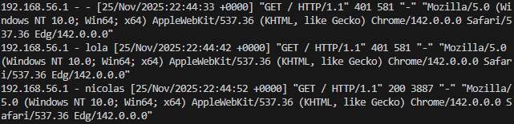
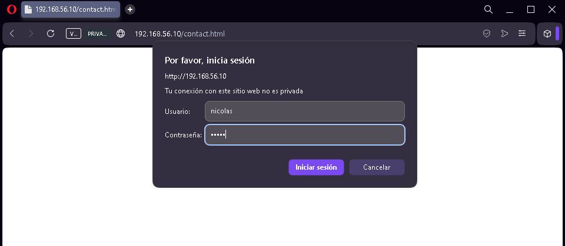
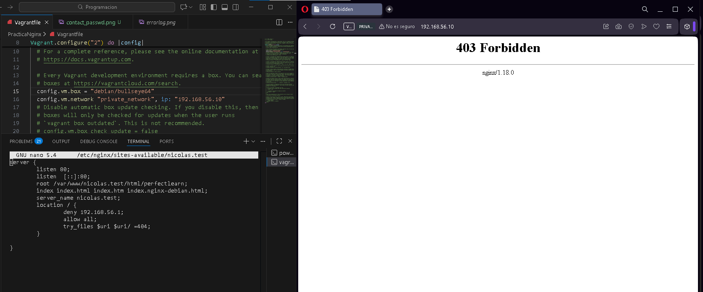
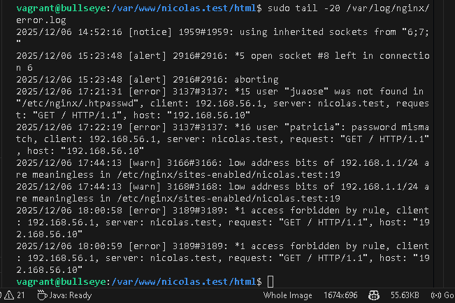
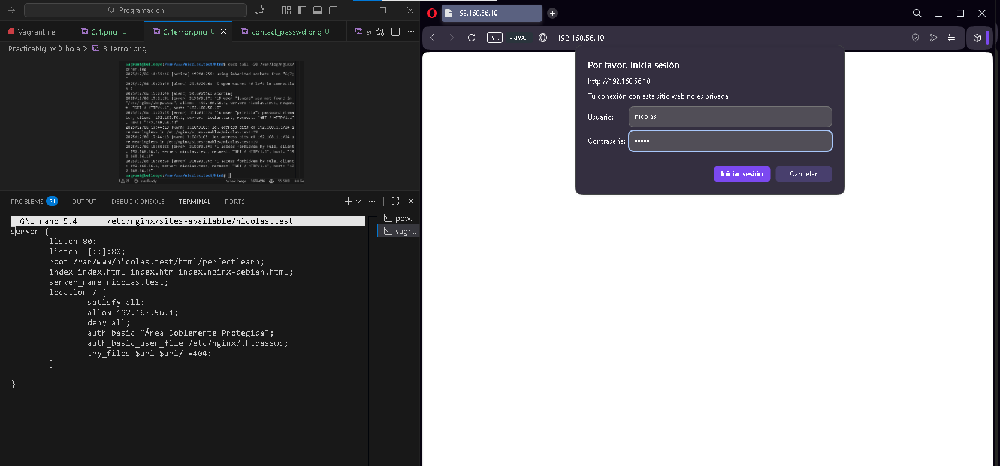
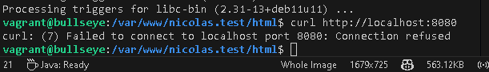

# Práctica 2.2: Autenticación en Nginx
## Nicolás López

---

## Tabla de Contenidos
1. [Introducción](#introducción)
2. [Requisitos Previos](#requisitos-previos)
3. [Configuración del Entorno](#configuración-del-entorno)
4. [Creación de Usuarios y Contraseñas](#creación-de-usuarios-y-contraseñas)
5. [Configuración Básica de Autenticación](#configuración-básica-de-autenticación)
6. [Tareas Realizadas](#tareas-realizadas)
   - [Tarea 1: Registro de Intentos de Acceso](#tarea-1-registro-de-intentos-de-acceso)
   - [Tarea 2: Autenticación en Sección Específica](#tarea-2-autenticación-en-sección-específica)
   - [Tarea 3: Restricción por IP](#tarea-3-restricción-por-ip)
   - [Tarea 4: Doble Protección](#tarea-4-doble-protección)
7. [Verificación y Pruebas](#verificación-y-pruebas)
8. [Conclusiones](#conclusiones)

---

## Introducción

La autenticación HTTP básica es un método fundamental para controlar el acceso a recursos web. En esta práctica se implementa autenticación básica en Nginx, combinándola con restricciones de acceso por dirección IP para crear diferentes niveles de seguridad.

### Objetivos
- Implementar autenticación HTTP básica en Nginx
- Proteger secciones específicas de un sitio web
- Combinar autenticación con restricciones por IP
- Configurar múltiples niveles de acceso

---

## Requisitos Previos

### Software Necesario
- **Vagrant**: Para la gestión de la máquina virtual
- **VirtualBox**: Como proveedor de virtualización
- **Debian Bullseye**: Sistema operativo de la VM
- **Nginx**: Servidor web
- **OpenSSL**: Para generación de contraseñas cifradas

### Conocimientos Previos
- Práctica 2.1 completada y funcionando
- Configuración básica de Nginx
- Conocimientos básicos de Linux/Bash
- Gestión de archivos de configuración

---

## Configuración del Entorno

### Arquitectura de Red

```
Máquina Anfitriona (Host)
IP: 192.168.56.1
        |
        | Red Privada VirtualBox
        |
Máquina Virtual (Vagrant)
IP: 192.168.56.10
Sistema: Debian Bullseye
Servidor: Nginx
```

### Estructura de Directorios

```
/var/www/
├── nicolas.test/
│   └── html/
│       └── perfectlearn/
│           ├── index.html
│           ├── contact.html
│           └── assets/
└── segundo-sitio/
    └── html/
        └── index.html

/etc/nginx/
├── nginx.conf
├── .htpasswd
├── sites-available/
│   ├── nicolas.test
│   └── segundo-sitio
└── sites-enabled/
    ├── nicolas.test -> ../sites-available/nicolas.test
    └── segundo-sitio -> ../sites-available/segundo-sitio
```

### Vagrantfile Configurado

```ruby
    Vagrant.configure("2") do |config|
        config.vm.box = "debian/bullseye64"
        config.vm.network "private_network", ip: "192.168.56.10"
    end
end
```

---

## Creación de Usuarios y Contraseñas

### Verificación de OpenSSL

Primero verificamos que OpenSSL esté instalado:

```bash
dpkg -l | grep openssl
```

### Creación del Archivo de Contraseñas

Se creó el archivo `.htpasswd` en `/etc/nginx/` con dos usuarios:

```bash
# Crear usuario nicolas
sudo sh -c "echo -n 'nicolas:' >> /etc/nginx/.htpasswd"
sudo sh -c "openssl passwd -apr1 >> /etc/nginx/.htpasswd"

# Crear usuario novoa
sudo sh -c "echo -n 'novoa:' >> /etc/nginx/.htpasswd"
sudo sh -c "openssl passwd -apr1 >> /etc/nginx/.htpasswd"

# Crear usuario patricia
sudo sh -c "echo -n 'patricia:' >> /etc/nginx/.htpasswd"
sudo sh -c "openssl passwd -apr1 >> /etc/nginx/.htpasswd"

# Crear usuario lola
sudo sh -c "echo -n 'lola:' >> /etc/nginx/.htpasswd"
sudo sh -c "openssl passwd -apr1 >> /etc/nginx/.htpasswd"
```

### Verificación del Archivo



El archivo `.htpasswd` resultante contiene las contraseñas cifradas con el algoritmo APR1:

```
nicolas:$apr1$MWRKjxVD$cCo/AquQPR7srp9z11YoS1
novoa:$apr1$tBsbbRdb$ihaQMEe7pKYrQWLbKCP4..
```

---

## Configuración Básica de Autenticación

### Sitio Web Principal: nicolas.test

Archivo: `/etc/nginx/sites-available/nicolas.test`

```nginx
server {
    listen 80;
    listen [::]:80;
    root /var/www/nicolas.test/html/perfectlearn;
    index index.html index.htm index.nginx-debian.html;
    server_name nicolas.test;
    
    location / {
        auth_basic "Área restringida";
        auth_basic_user_file /etc/nginx/.htpasswd;
        try_files $uri $uri/ =404;
    }
}
```

### Directivas Importantes

- **`auth_basic`**: Define el mensaje que aparecerá en el diálogo de autenticación
- **`auth_basic_user_file`**: Ruta al archivo que contiene usuarios y contraseñas
- **`try_files`**: Intenta servir el archivo solicitado o devuelve error 404

---

## Tareas Realizadas

### Tarea 1: Registro de Intentos de Acceso

#### Objetivo
Verificar que los logs de Nginx registren correctamente tanto intentos fallidos como exitosos de autenticación.

#### Pruebas Realizadas

1. **Intento con usuario inválido** (`lola`)
2. **Intento con usuario válido** (`nicolas`)

#### Logs Observados



**Análisis del error.log:**

```log
2025/11/25 22:44:42 [error] 3578#3578: *12 user "lola" was not found in 
"/etc/nginx/.htpasswd", client: 192.168.56.1, server: nicolas.test, 
request: "GET / HTTP/1.1", host: "192.168.56.10"
```

**Códigos HTTP observados:**



- **401 Unauthorized**: Usuario no proporcionado o credenciales inválidas
- **200 OK**: Autenticación exitosa
- **304 Not Modified**: Contenido en caché del navegador

#### Conclusiones

El sistema de logs registra correctamente:
- Intentos con usuarios inexistentes
- Intentos con contraseñas incorrectas
- Accesos exitosos con usuario y contraseña válidos
- La IP del cliente que realiza la petición

---

### Tarea 2: Autenticación en Sección Específica

#### Objetivo
Proteger únicamente la página `contact.html` en lugar de todo el sitio web.

#### Configuración Modificada

Se modificó el archivo `/etc/nginx/sites-available/nicolas.test`:

```nginx
server {
    listen 80;
    listen [::]:80;
    root /var/www/nicolas.test/html/perfectlearn;
    index index.html index.htm index.nginx-debian.html;
    server_name nicolas.test;
    
    # Acceso público a la raíz
    location / {
        try_files $uri $uri/ =404;
    }
    
    # Protección específica para contact.html
    location = /contact.html {
        auth_basic "Área restringida";
        auth_basic_user_file /etc/nginx/.htpasswd;
        try_files $uri =404;
    }
}
```

**Acceso a la página principal (sin autenticación):**


La página principal de Perfect Learn es accesible sin requerir credenciales.

**Acceso a contact.html (con autenticación):**



Al intentar acceder a `/contact.html`, aparece el diálogo de autenticación.

#### Ventajas de esta Configuración

- La página principal permanece pública
- Solo las secciones sensibles requieren autenticación
- Mayor flexibilidad en el control de acceso
- Mejor experiencia de usuario

---

### Tarea 3: Restricción por IP

#### Objetivo
Denegar el acceso desde la máquina anfitriona (192.168.56.1) al sitio web principal.

#### Configuración Implementada

```nginx
server {
    listen 80;
    listen [::]:80;
    root /var/www/nicolas.test/html/perfectlearn;
    index index.html index.htm index.nginx-debian.html;
    server_name nicolas.test;
    
    location / {
        # Denegar acceso a la IP del anfitrión
        deny 192.168.56.1;
        # Permitir todas las demás IPs
        allow all;
        
        try_files $uri $uri/ =404;
    }
}
```

#### Pruebas y Resultados

**Error 403 en el navegador:**



El navegador muestra claramente que el acceso ha sido denegado con un error **403 Forbidden** generado por Nginx 1.18.0.

**Registro en error.log:**



```log
2025/12/06 18:00:59 [error] 3189#3189: *1 access forbidden by rule, 
client: 192.168.56.1, server: nicolas.test, request: "GET / HTTP/1.1", 
host: "192.168.56.10"
```

#### Análisis

- La directiva `deny` bloquea efectivamente la IP especificada
- El mensaje de error es claro: "access forbidden by rule"
- El código HTTP 403 indica prohibición por reglas del servidor
- El log registra la IP denegada y la razón del rechazo

---

### Tarea 4: Doble Protección

#### Objetivo
Crear un segundo sitio web que requiera **TANTO** una IP válida **COMO** credenciales de usuario válidas (ambas condiciones simultáneamente).

#### Creación del Segundo Sitio

```bash
# Crear estructura de directorios
sudo mkdir -p /var/www/segundo-sitio/html

# Crear página de ejemplo
echo "<h1>Segundo Sitio - Doble Protección</h1>" | \
    sudo tee /var/www/segundo-sitio/html/index.html

# Ajustar permisos
sudo chown -R www-data:www-data /var/www/segundo-sitio
```

#### Configuración con satisfy all

Archivo: `/etc/nginx/sites-available/segundo-sitio`

```nginx
server {
    listen 8080;
    listen [::]:8080;
    root /var/www/segundo-sitio/html;
    index index.html index.htm;
    server_name 192.168.56.10;
    
    location / {
        # satisfy all = requiere AMBAS condiciones
        satisfy all;
        
        # Control de acceso por IP
        allow 192.168.56.1;  # Solo la IP del anfitrión
        deny all;            # Denegar todas las demás
        
        # Autenticación básica
        auth_basic "Área Doblemente Protegida";
        auth_basic_user_file /etc/nginx/.htpasswd;
        
        try_files $uri $uri/ =404;
    }
}
```

#### Activación del Sitio

```bash
# Crear enlace simbólico
sudo ln -s /etc/nginx/sites-available/segundo-sitio /etc/nginx/sites-enabled/

# Verificar configuración
sudo nginx -t

# Reiniciar Nginx
sudo systemctl restart nginx
```

#### Pruebas de Acceso

**1. Acceso desde IP válida (192.168.56.1):**



Como la IP es válida, el sistema solicita credenciales de usuario.

**2. Acceso exitoso tras autenticación:**


Después de ingresar credenciales correctas, se obtiene acceso al sitio.

**3. Acceso desde IP no autorizada (localhost en la VM):**



```bash
vagrant@bullseye:/var/www/nicolas.test/html$ curl http://localhost:8080
curl: (7) Failed to connect to localhost port 8080: Connection refused
```

Desde localhost (127.0.0.1), el acceso es denegado porque la IP no está en la lista de permitidas, **incluso sin solicitar credenciales**.

#### Diferencia: satisfy all vs satisfy any

```nginx
# satisfy all - Requiere IP válida Y autenticación
satisfy all;
allow 192.168.56.1;
deny all;
auth_basic "Protegido";
auth_basic_user_file /etc/nginx/.htpasswd;

# satisfy any - Requiere IP válida O autenticación
satisfy any;
allow 192.168.56.1;
deny all;
auth_basic "Protegido";
auth_basic_user_file /etc/nginx/.htpasswd;
```

Con `satisfy all`:
- Si la IP NO es válida → Acceso denegado inmediatamente
- Si la IP es válida → Se solicita autenticación
- Si la autenticación falla → Acceso denegado

Con `satisfy any`:
- Si la IP es válida → Acceso permitido sin autenticación
- Si la IP NO es válida → Se solicita autenticación
- Si la autenticación es válida → Acceso permitido

---

## Verificación y Pruebas

### Resumen de Configuraciones

| Sitio | Puerto | Autenticación | Restricción IP | Directiva satisfy |
|-------|--------|---------------|----------------|-------------------|
| nicolas.test (/) | 80 | No | Sí (deny 192.168.56.1) | - |
| nicolas.test (/contact.html) | 80 | Sí | No | - |
| segundo-sitio | 8080 | Sí | Sí (allow 192.168.56.1) | all |

### Comandos de Verificación

```bash
# Verificar sintaxis de Nginx
sudo nginx -t

# Ver estado del servicio
sudo systemctl status nginx

# Ver logs en tiempo real
sudo tail -f /var/log/nginx/error.log
sudo tail -f /var/log/nginx/access.log

# Verificar puertos en escucha
sudo netstat -tulpn | grep nginx

# Probar desde línea de comandos
curl -I http://192.168.56.10
curl -u nicolas:password http://192.168.56.10/contact.html
```

**Autor**: Nicolás López  
**Fecha**: Diciembre 2025  
**Asignatura**: Despliegue de Aplicaciones Web  
**Práctica**: 2.2 - Autenticación en Nginx