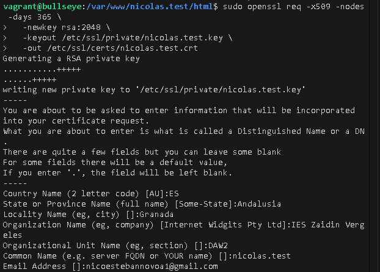
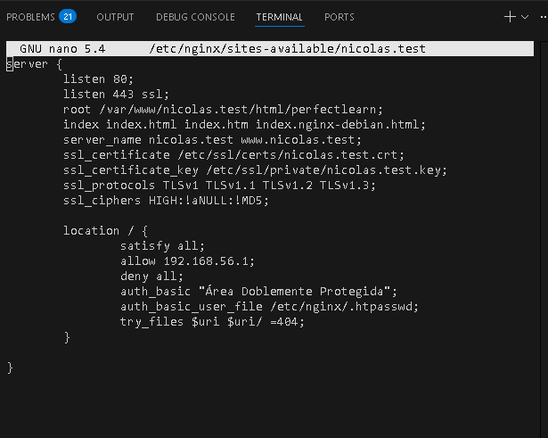
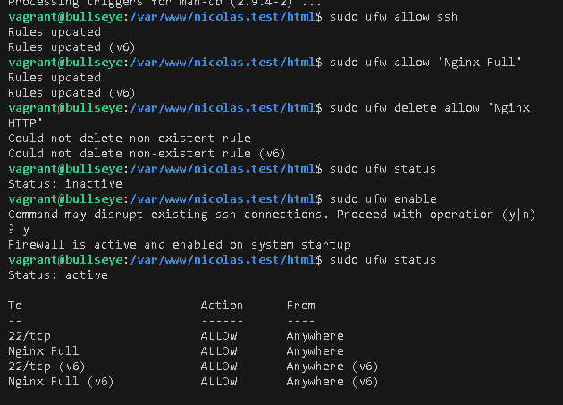

# Práctica 2.3: Acceso Seguro con SSL/TLS en Nginx
## Nicolás Esteban López Novoa

---

## Introducción

Esta práctica implementa el protocolo SSL/TLS en un servidor web Nginx para habilitar conexiones seguras mediante HTTPS. Se configura un certificado autofirmado que permite cifrar la comunicación entre el cliente y el servidor, protegiendo la información transmitida. Además, se establece una doble capa de seguridad combinando autenticación de usuario con restricción de acceso por dirección IP.

---

## Tabla de Contenidos

1. [Configuración del Archivo Hosts](#1-configuración-del-archivo-hosts)
2. [Generación del Certificado SSL Autofirmado](#2-generación-del-certificado-ssl-autofirmado)
3. [Configuración de Nginx con SSL](#3-configuración-de-nginx-con-ssl)
4. [Configuración del Cortafuegos UFW](#4-configuración-del-cortafuegos-ufw)
5. [Verificación del Sitio con HTTPS](#5-verificación-del-sitio-con-https)
6. [Conclusiones](#conclusiones)

---

## 1. Configuración del Archivo Hosts

Para resolver el nombre de dominio `nicolas.test` a la dirección IP de la máquina virtual, se modificó el archivo hosts del sistema anfitrión.

**En Windows (como Administrador):**

```
C:\Windows\System32\drivers\etc\hosts
```

Se agregaron las siguientes líneas:

```
192.168.56.10    nicolas.test
192.168.56.10    www.nicolas.test
```

---

## 2. Generación del Certificado SSL Autofirmado

Se generó un certificado SSL autofirmado válido por 365 días utilizando OpenSSL.

### Comando Ejecutado

```bash
sudo openssl req -x509 -nodes -days 365 \
  -newkey rsa:2048 \
  -keyout /etc/ssl/private/nicolas.test.key \
  -out /etc/ssl/certs/nicolas.test.crt
```

### Datos del Certificado



Se completaron los siguientes campos:

- **Country Name**: ES
- **State or Province Name**: Andalusia
- **Locality Name**: Granada
- **Organization Name**: IES Zaidín Vergeles
- **Organizational Unit Name**: DAW2
- **Common Name**: nicolas.test
- **Email Address**: nicoesebannova@gmail.com

### Verificación de Archivos Creados

```bash
sudo ls -l /etc/ssl/private/nicolas.test.key
sudo ls -l /etc/ssl/certs/nicolas.test.crt
```

---

## 3. Configuración de Nginx con SSL

Se modificó el archivo de configuración del sitio para habilitar HTTPS en el puerto 443 y combinar seguridad SSL con autenticación de usuario y restricción de IP.

### Archivo de Configuración

**Ruta:** `/etc/nginx/sites-available/nicolas.test`



```nginx
server {
    listen 80;
    listen 443 ssl;
    
    root /var/www/nicolas.test/html/perfectlearn;
    index index.html index.htm index.nginx-debian.html;
    server_name nicolas.test www.nicolas.test;
    
    # Configuración SSL
    ssl_certificate /etc/ssl/certs/nicolas.test.crt;
    ssl_certificate_key /etc/ssl/private/nicolas.test.key;
    ssl_protocols TLSv1 TLSv1.1 TLSv1.2 TLSv1.3;
    ssl_ciphers HIGH:!aNULL:!MD5;
    
    location / {
        # Doble protección: IP válida Y autenticación
        satisfy all;
        allow 192.168.56.1;
        deny all;
        
        auth_basic "Área Doblemente Protegida";
        auth_basic_user_file /etc/nginx/.htpasswd;
        
        try_files $uri $uri/ =404;
    }
}
```

### Directivas SSL Importantes

- **`ssl_certificate`**: Ruta al certificado público
- **`ssl_certificate_key`**: Ruta a la clave privada
- **`ssl_protocols`**: Versiones de TLS permitidas
- **`ssl_ciphers`**: Algoritmos de cifrado permitidos

### Verificación y Recarga

```bash
sudo nginx -t
sudo systemctl reload nginx
```

---

## 4. Configuración del Cortafuegos UFW

Se configuró el cortafuegos UFW para permitir tráfico HTTPS en el puerto 443, además del tráfico HTTP y SSH.

### Comandos Ejecutados



```bash
# Permitir SSH
sudo ufw allow ssh

# Permitir HTTP y HTTPS
sudo ufw allow 'Nginx Full'

# Eliminar reglas duplicadas de solo HTTP
sudo ufw delete allow 'Nginx HTTP'

# Habilitar el cortafuegos
sudo ufw enable

# Verificar estado
sudo ufw status
```

### Estado Final del Cortafuegos

```
Status: active

To                         Action      From
--                         ------      ----
22/tcp                     ALLOW       Anywhere
Nginx Full                 ALLOW       Anywhere
22/tcp (v6)                ALLOW       Anywhere (v6)
Nginx Full (v6)            ALLOW       Anywhere (v6)
```

El cortafuegos permite conexiones en:
- Puerto 22 (SSH)
- Puerto 80 (HTTP)
- Puerto 443 (HTTPS)

---

## 5. Verificación del Sitio con HTTPS

### Acceso mediante Navegador

Al acceder a `https://www.nicolas.test`, el navegador muestra una advertencia de seguridad indicando que "La conexión no es privada".

**Razón:** El certificado es autofirmado y no está validado por una Autoridad de Certificación reconocida.

**Solución:** Se acepta el riesgo de seguridad haciendo clic en "Avanzado" → "Continuar a www.nicolas.test (no seguro)".

### Sitio Funcionando con HTTPS


Una vez aceptada la advertencia, el sitio web carga correctamente sobre HTTPS. Se observa:

- URL con protocolo **https://**
- Candado con la indicación "No seguro" (esperado con certificados autofirmados)
- Página web "Perfect Learn" completamente funcional
- Conexión cifrada activa

### Doble Protección Activa

La configuración implementada requiere:

1. **IP válida**: Solo permite acceso desde `192.168.56.1` (máquina anfitriona)
2. **Autenticación de usuario**: Solicita credenciales válidas del archivo `.htpasswd`

Ambas condiciones deben cumplirse simultáneamente gracias a la directiva `satisfy all`.

### Verificación desde Terminal

```bash
# Probar HTTPS ignorando verificación del certificado
curl -Ik https://nicolas.test

# Verificar puertos en escucha
sudo netstat -tulpn | grep nginx
```

**Resultado esperado:**
- Nginx escuchando en puerto 80 (HTTP)
- Nginx escuchando en puerto 443 (HTTPS)
- Respuesta HTTP/1.1 200 OK

---

## Conclusiones

Se implementó exitosamente SSL/TLS en Nginx utilizando un certificado autofirmado, habilitando conexiones seguras mediante HTTPS en el puerto 443. La configuración incluye protocolos TLS modernos y cifrados seguros para proteger la comunicación entre cliente y servidor.

Adicionalmente, se estableció una doble capa de seguridad combinando restricción de acceso por IP con autenticación básica HTTP, requiriendo que ambas condiciones se cumplan simultáneamente mediante la directiva `satisfy all`.

El cortafuegos UFW se configuró correctamente para permitir tráfico en los puertos necesarios (SSH, HTTP y HTTPS), manteniendo el servidor protegido contra accesos no autorizados.

Aunque el navegador muestra advertencias de seguridad debido a que el certificado es autofirmado, esta configuración es apropiada para entornos de desarrollo y pruebas. En un entorno de producción se utilizaría un certificado válido emitido por una Autoridad de Certificación reconocida como Let's Encrypt.

---

**Autor:** Nicolás Esteban López Novoa  
**Fecha:** Diciembre 2025  
**Práctica:** 2.3 - Acceso Seguro con SSL/TLS en Nginx