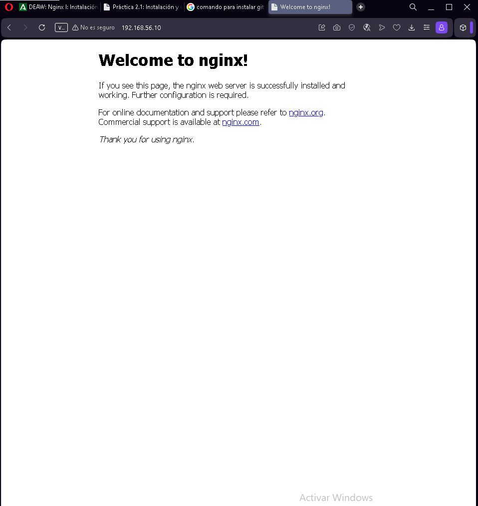
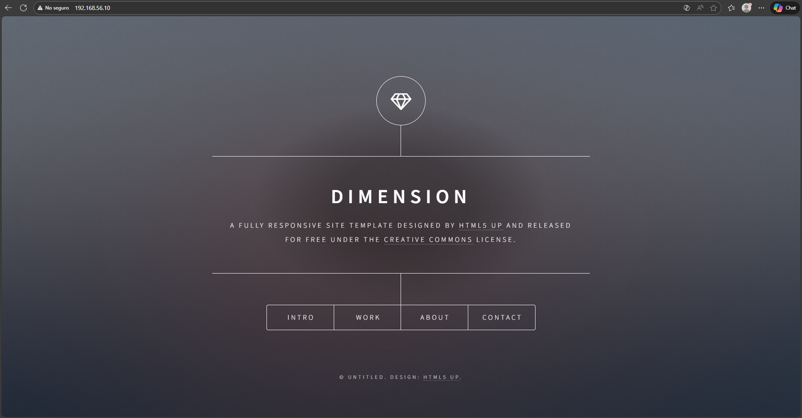
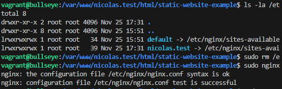
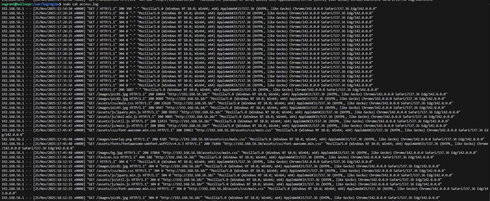
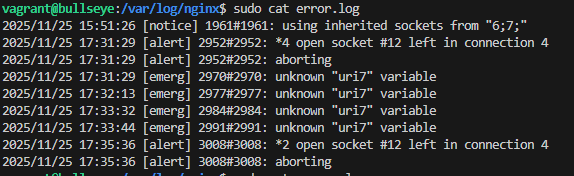

# VM con NGINX
## Grupo: Nicolas Esteban Lopez Novoa y Daniel Dominguez Morilla
### Entrega de la Primera parte: Nginx con Maquina Virtual, por Nicolas Lopez

__primero__: la configuracion inicial y la instalacion de nginx.
se hizo el apt update, el install git y nginx, se crearon los directorios y cambiaron los permisos

__segundo__: la configuracion inicial y la instalacion de nginx.
se clono el repositorio indicado en la practica y se enlazaron las rutas. tambien tuve que eliminar el default de nginx porque siempre salia en vez de mi html

__tercero__: la configuracion inicial y la instalacion de nginx.
Aqui esta la captura de que se muestran correctamente las entradas a la pagina, con un codigo 200 de cuando la cargue inicialmente y el resto de acciones con la pagina
ya cacheada

__cuarto__: la configuracion inicial y la instalacion de nginx.
los errores del "uri7" son porque me equivoque en la configuracion del sites-available/nicolas.test
en vez de poner &uri/ puse $uri7
